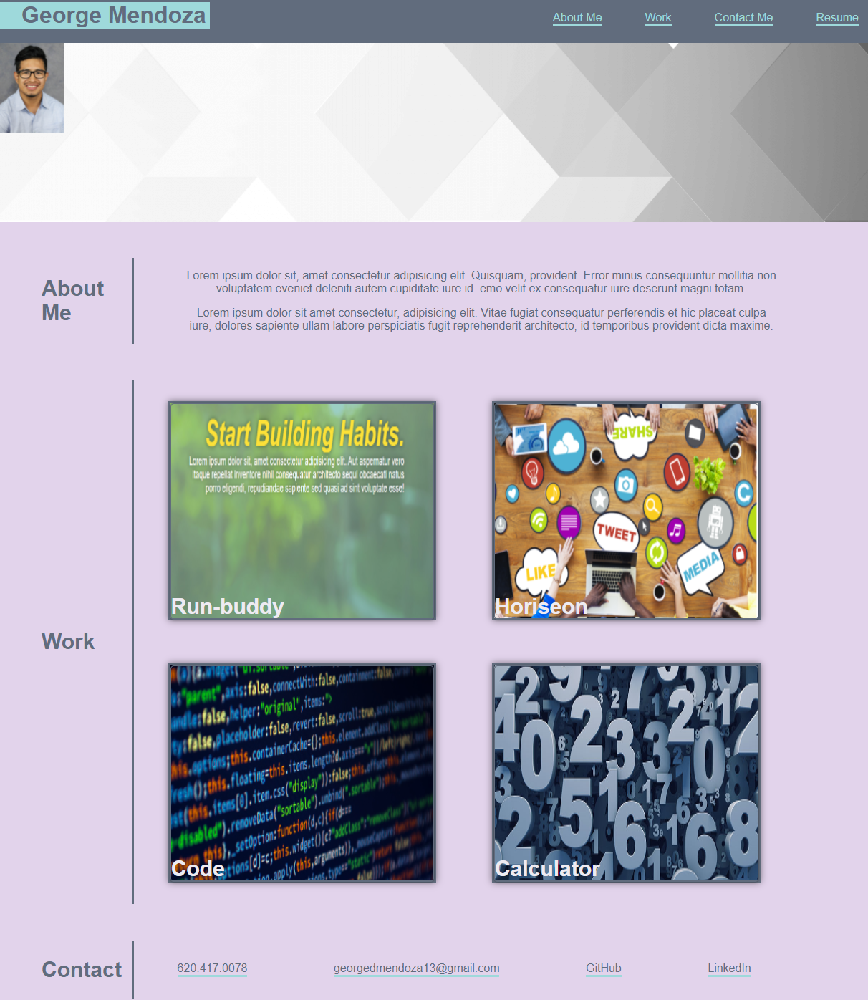

# professional-portfolio

## Description
This portfolio was created to showcase my current/future projects that I will be working on along with the skills that I used for each project. Each of these projects can be visited within the portfolio page. This website was created using html and advanced css. One of the major components that I focused on was flexbox in css. This was very helpful due to its flexibility and it made it easier to adjust the website according to different screen sizes. In the future I hope to add more projects to this website. I also plan to use bootstap to enhance the way the website looks and make it easier to edit/build.

Application link

https://georgedmendoza.github.io/professional-portfolio/

## Usage

Below is a screenshot of the full website. This image will give you an overview of the information that can be accessed in the website.  

